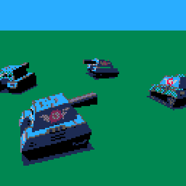

# PicoCAD Client

Starter kit 3d engine to display PicoCAD models:

- basic FPS controller
- perspective camera
- optimized transform & project pipeline
- global sorting



>Note: sample code requires [Pico8](https://www.lexaloffle.com/pico-8.php)

Many points are left to the reader:
- efficient culling of non visible objects
- near plane clipping
- collision & anything related to a particular game

## How To Use
- Edit model using [PicoCAD](https://johanpeitz.itch.io/picocad)
- Export model to p8l file
- Edit p8l file to remove comments
- Copy texture image in picocad_player.p8 cart
- Edit Include p8l file in picocad_player.p8. Ex:
```
#include chunky_tank.p8l
```
- Create 3d entity in _init with:
```
  _entities={
    -- initial (x,y,z) position + reference to 3d model  
    -- note: y is up  
    make_3dobject({5,0,5},chunky_tank)
  }
```
- Change game logic/structure to fit your game!
- Good luck

## Credits

Tank model by [Johan Peitz](https://twitter.com/johanpeitz)

Sort by [Morgan McGuire](https://github.com/morgan3d/misc/tree/master/p8sort)

## Licence

Sample code is licenced under: [Creative Commons Attribution 4.0 International Public License](https://creativecommons.org/licenses/by/4.0/legalcode)

